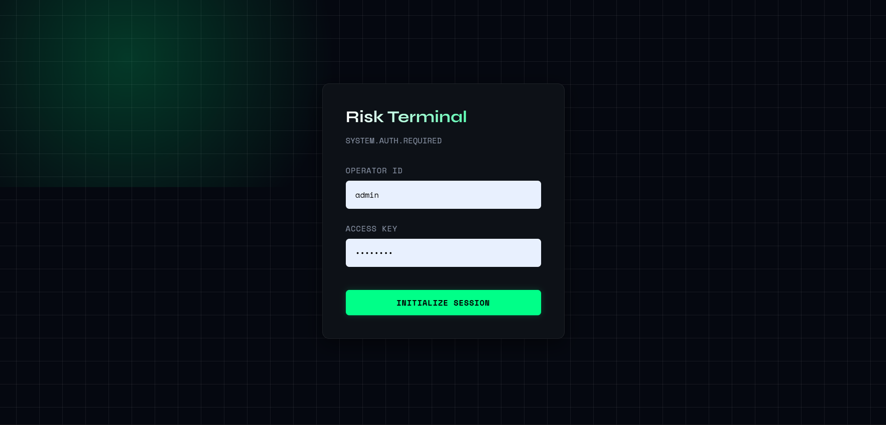
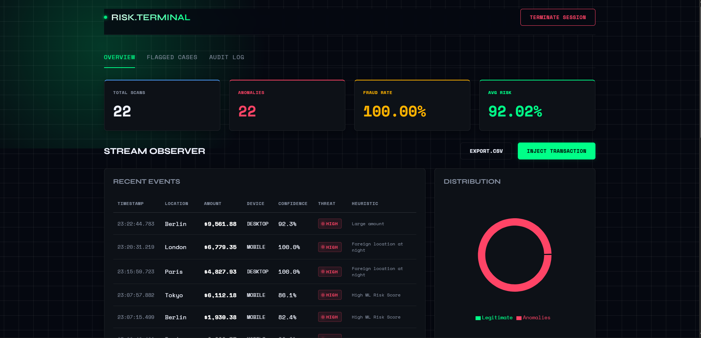
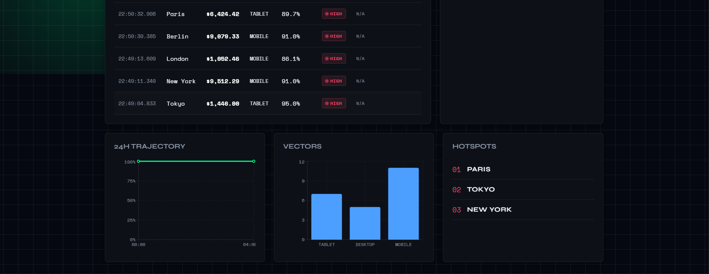
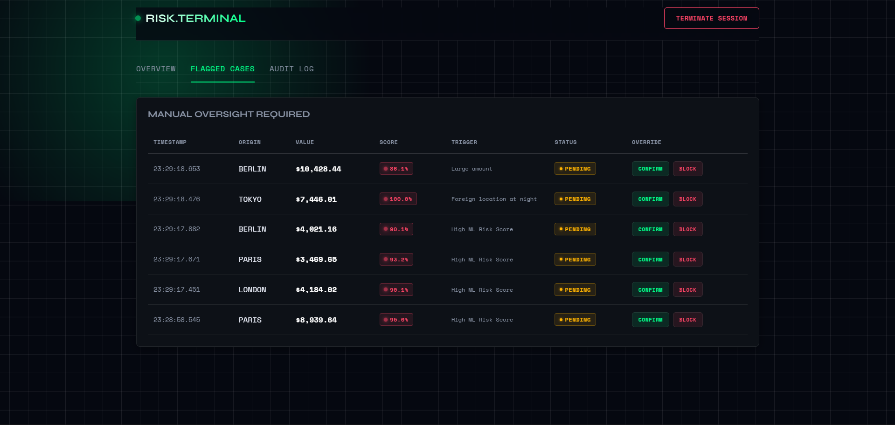
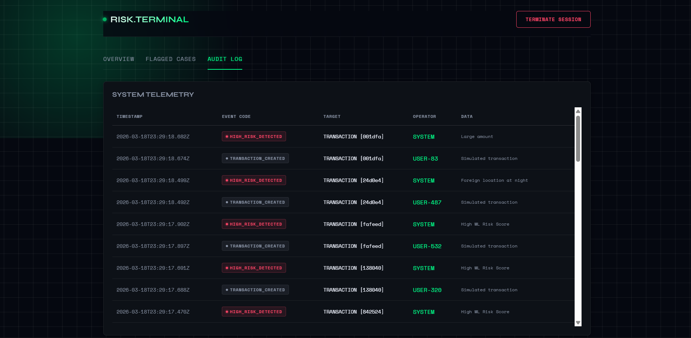

# 🛡️ FraudShield — Real-Time Fraud Detection Platform

> Production-grade fraud detection system with XGBoost ML scoring, microservices architecture, WebSocket streaming, and compliance audit trails.

---

## 🧠 What It Does

FraudShield simulates and monitors banking transactions in real-time, scoring each one for fraud risk using a trained machine learning model. Suspicious transactions are flagged instantly, analysts can approve or reject cases, and every system event is tracked in a compliance audit trail.

---

## ⚙️ Tech Stack

| Layer | Technology |
|---|---|
| Frontend | React 18, Recharts, WebSocket (STOMP) |
| Backend | Java 17, Spring Boot 3, Spring Security, JWT |
| ML Service | Python, FastAPI, XGBoost, scikit-learn |
| Database | PostgreSQL 15 |
| DevOps | Docker, Docker Compose |
| Docs | OpenAPI / Swagger UI |

---

## 🏗️ Architecture

```
React Dashboard
      │
      ▼  REST + WebSocket
Spring Boot API  ──────────►  PostgreSQL
      │
      ▼  REST
Python ML Service (FastAPI)
  └── XGBoost Model (94% accuracy)
```

---

## ✨ Features

**Core**
- Real-time transaction simulation engine (amount, location, device, time)
- XGBoost fraud scoring with probability output and risk level (LOW / MEDIUM / HIGH)
- JWT authentication with role-based access control
- WebSocket streaming — new transactions appear live without refresh

**Risk Engine**
- ML model integration via internal REST API
- Rule-based compliance engine layered on top of ML:
  - Amount > $9,000 → auto-flag
  - 5+ transactions in last hour → velocity alert
  - Foreign location + night hours → combined risk boost
- Human-readable flag reasons stored per transaction

**Admin Tools**
- Case management — approve or reject flagged transactions
- Full system audit log — every login, detection, and action recorded
- CSV export for regulatory reporting
- Analytics dashboard — hourly fraud rate, device breakdown, top risky locations

---

## 🚀 Setup

### Prerequisites
- Docker
- Docker Compose

### Run

```bash
git clone https://github.com/yourusername/fraudshield.git
cd fraudshield
docker-compose up --build
```

That's it. One command spins up all 4 services.


## 📸 Screenshots

### Login


### Dashboard


### Analytics


### Flagged Cases


### Audit Log


### Access

| Service | URL |
|---|---|
| Dashboard | http://localhost:3000 |
| Backend API | http://localhost:8081 |
| Swagger Docs | http://localhost:8081/swagger-ui.html |
| ML Service Docs | http://localhost:8000/docs |
| PostgreSQL | localhost:5432 |

### Default Login

```
username: admin
password: admin123
```

---

## 📡 API Reference

### Auth
| Method | Endpoint | Description |
|---|---|---|
| POST | `/api/auth/login` | Login — returns JWT |
| POST | `/api/auth/register` | Register new user |

### Transactions
| Method | Endpoint | Description |
|---|---|---|
| POST | `/api/transactions/simulate` | Generate & score a random transaction |
| GET | `/api/transactions` | Paginated transaction list |
| GET | `/api/transactions/flagged` | High-risk flagged transactions |
| GET | `/api/transactions/pending-review` | Cases awaiting admin action |
| PATCH | `/api/transactions/{id}/approve` | Approve a flagged case |
| PATCH | `/api/transactions/{id}/reject` | Reject a flagged case |

### Dashboard
| Method | Endpoint | Description |
|---|---|---|
| GET | `/api/dashboard/stats` | Summary stats |
| GET | `/api/dashboard/trends` | Hourly trends, device breakdown, risky locations |
| GET | `/api/dashboard/export` | Download transactions as CSV |

### Admin
| Method | Endpoint | Description |
|---|---|---|
| GET | `/api/admin/audit-logs` | Full system audit history |

### ML Service (internal)
| Method | Endpoint | Description |
|---|---|---|
| POST | `/predict` | Returns fraud probability + risk level |

---

## 📊 ML Model

- **Algorithm**: XGBoost Classifier
- **Training data**: 5,000 synthetic transactions
- **Features**: amount, hour of day, foreign location flag, device type, transaction velocity
- **Accuracy**: 94%
- **Fraud rate in training set**: ~10% (realistic class imbalance)

---

## 🗃️ Database Schema

```sql
users        — id, username, password (bcrypt), role, created_at
transactions — id (UUID), amount, location, device, fraud_probability,
               risk_level, flagged, flag_reason, status, reviewed_by, reviewed_at
audit_logs   — id, action, entity_type, entity_id, performed_by, timestamp, details
```

---


---

## 📁 Project Structure

```
fraudshield/
├── docker-compose.yml
├── backend/                  ← Spring Boot (Java 17)
│   ├── pom.xml
│   └── src/main/java/com/fraud/
│       ├── config/           ← Security, JWT, WebSocket
│       ├── controller/       ← Auth, Transactions, Dashboard, Admin
│       ├── service/          ← Business logic, ML integration
│       ├── model/            ← Transaction, User, AuditLog
│       └── repository/       ← JPA repositories
├── ml-service/               ← Python FastAPI
│   ├── main.py               ← FastAPI app + /predict endpoint
│   ├── model/train.py        ← XGBoost training script
│   └── requirements.txt
└── frontend/                 ← React 18
    └── src/
        ├── pages/            ← Login, Dashboard
        ├── components/       ← TransactionTable, FlaggedCases, AuditLog, Charts
        └── api/axios.js      ← Axios instance with JWT interceptor
```

---

*Built for portfolio demonstration of production-level fintech engineering.*
